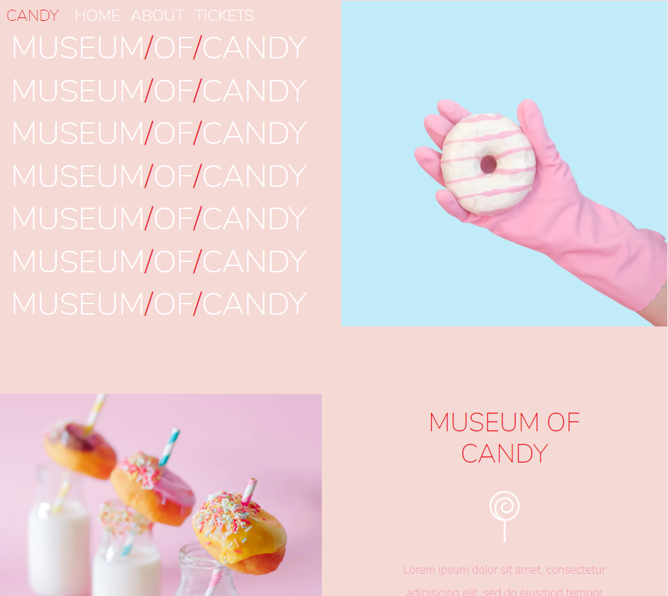
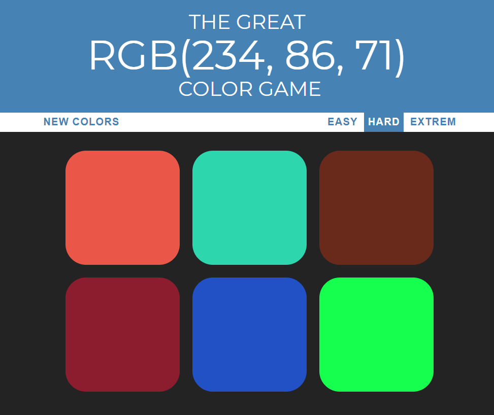
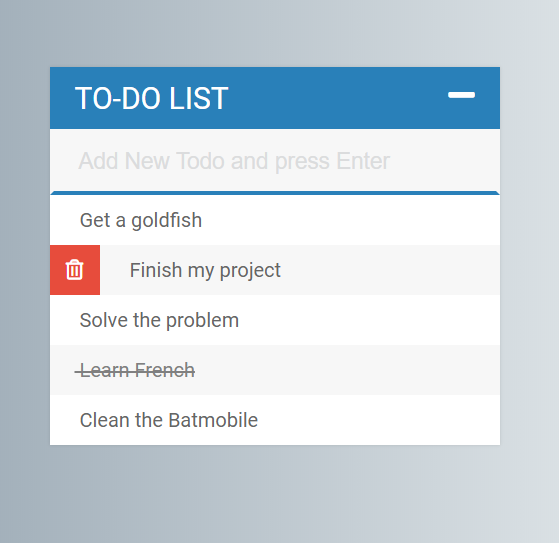
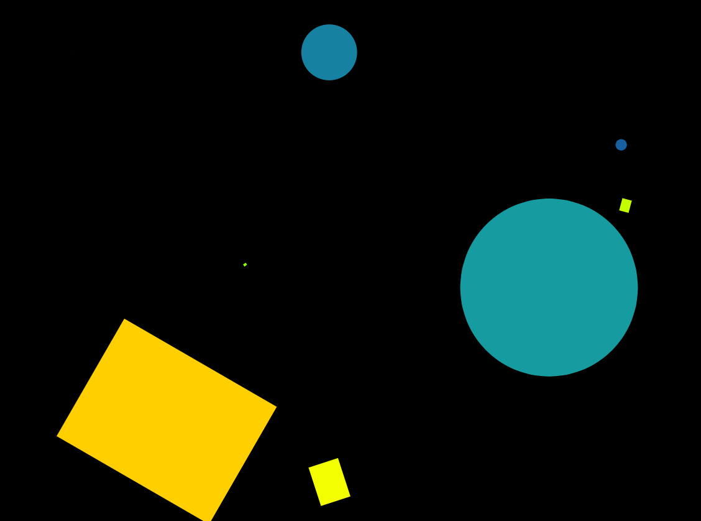

# WebDev
This is my work on Web Development

# Details
## Pure HTML and CSS
Blog -> html and css for simple blog posts formatting

PhotoPage -> html and css for simple page to display photos

Bootstrap -> html pages playing with Bootstrap CSS

Museum of Candy -> A page built with Bootstrap but doesn't look as "Bootstrapy" with a lot of responsiveness

## JavaScript
Color Game -> Guess the RGB color

To-Do List -> A to-do list app 

MagicKeys -> Press keys on the keyboard to get a sound and animation (works for keys QWERASDF)

## NodeJS app

BlogApp -> a blog app built with MongoDB, Express.js and Node.js - style with Semantic UI
